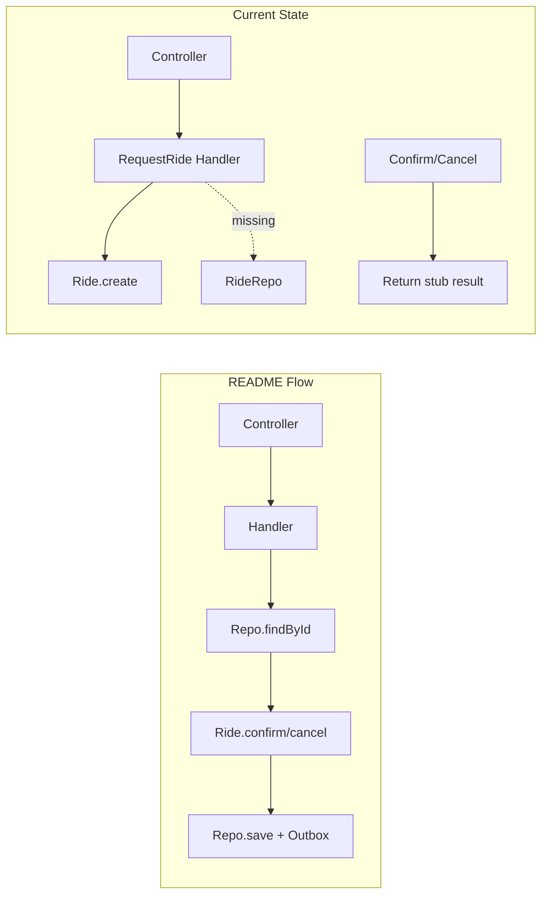

# Ride Bounded Context — DDD Architecture Review

**Scope:** `src/domains/ride/` against [README.md](./README.md)  
**Perspective:** Backend Architect + Software Architect  
**Focus:** Domain layer completeness and DDD validity; application commands as blueprint only  
**Date:** June 11, 2026

---

## Executive Summary

| Layer                      | Maturity | Verdict                                                |
| -------------------------- | -------- | ------------------------------------------------------ |
| **Domain**                 | ~85%     | DDD-valid core; ready to build on                      |
| **Application (commands)** | ~25%     | Blueprint — structure exists, orchestration incomplete |
| **Application (queries)**  | 0%       | Not started                                            |
| **Infrastructure**         | ~15%     | Integration handler stubs only; no `RideRepo`          |
| **Presentation**           | ~50%     | 3 POST endpoints; no GET; validation drift             |

The **domain layer is the strongest part** of the ride context. The aggregate, value objects, invariants, and event raising follow README rules and tactical DDD. Application commands are correctly positioned as **blueprints** — folder layout and CQRS wiring are in place, but the README flow (`find → aggregate → save`) is not implemented except partially in `RequestRide`.

**Overall ride context maturity:** ~35% of what the Identity context already demonstrates in this codebase.

---

## 1. README Alignment

### What matches

| README requirement                                             | Implementation                                    |
| -------------------------------------------------------------- | ------------------------------------------------- |
| `Ride` aggregate: `create()`, `confirm()`, `cancel()`          | `ride.aggregate.ts`                               |
| Properties: id, customerId, locations, fareEstimate, status    | Present                                           |
| VOs: Money (>0, GBP/USD/EUR), Location (address/lat/lng rules) | `money.vo.ts`, `location.vo.ts`, `currency.vo.ts` |
| Status guard: only PENDING → CONFIRMED / CANCELLED             | `RideNotPendingException`                         |
| Domain events from aggregate behavior                          | Three events raised inside aggregate              |
| No NestJS / ORM in domain                                      | Confirmed — domain is framework-free              |
| CQRS command handlers                                          | Three handlers under `application/commands/`      |
| Thin controller                                                | `ride.controller.ts` delegates to `CommandBus`    |

### Deviations

| README                                                 | Actual                           | Severity |
| ------------------------------------------------------ | -------------------------------- | -------- |
| `POST/GET /api/v1/rides`                               | `POST /api/v1/ride` (singular)   | Minor    |
| `GET /rides/{rideId}`, `GET /rides`                    | Missing                          | Major    |
| `GetRideDetails`, `GetRideHistory` queries             | No `application/queries/`        | Major    |
| `RideRepo` (save + outbox, findById, listByCustomerId) | Not implemented                  | Critical |
| `RideRequestedEvent(customerId, rideId)`               | Only `rideId`                    | Major    |
| Repo interfaces in application layer                   | Missing `ride-repo.interface.ts` | Major    |

---

## 2. Domain Layer — DDD Validity (Primary Focus)

### Verdict: DDD-valid and substantially complete

The domain demonstrates correct tactical DDD. It can be evaluated independently of application/infrastructure.

### Strengths

**1. Rich aggregate with correct lifecycle**

```ts
// src/domains/ride/domain/ride.aggregate.ts
public static create(
  id: RideIdVO,
  customerId: CustomerId,
  pickupLocation: LocationVO,
  dropoffLocation: LocationVO,
  fareEstimate: MoneyVO,
): Ride {
  const ride = new Ride(
    id,
    customerId,
    pickupLocation,
    dropoffLocation,
    fareEstimate,
    RideStatus.PENDING,
  );
  ride.addDomainEvent(new RideRequestedEvent(ride.id.value));
  return ride;
}

public confirm(): void {
  if (this.status !== RideStatus.PENDING) {
    throw new RideNotPendingException();
  }
  this.status = RideStatus.CONFIRMED;
  this.addDomainEvent(new RideConfirmedEvent(this.id.value));
}

public cancel(): void {
  if (this.status !== RideStatus.PENDING) {
    throw new RideNotPendingException();
  }
  this.status = RideStatus.CANCELLED;
  this.addDomainEvent(new RideCancelledEvent(this.id.value));
}
```

- Private constructor + static factory (`create`) — correct pattern
- Invariants enforced inside the aggregate, not in handlers
- Events originate from state transitions, not application layer
- No persistence, I/O, or framework dependencies

**2. Immutable, self-validating value objects**

`LocationVO.create(address, latitude, longitude)` enforces address 3–200 chars and valid lat/lng ranges. `MoneyVO` requires amount > 0. `CurrencyVO` restricts to GBP | USD | EUR. All use private constructors — immutability is structural, not conventional.

**3. Ubiquitous language**

`RideStatus` (`pending`, `confirmed`, `cancelled`), `fareEstimate`, `pickupLocation` / `dropoffLocation` align with README terminology.

**4. Architecture rules respected**

| Rule                                    | Status |
| --------------------------------------- | ------ |
| No NestJS decorators in domain          | Pass   |
| No Prisma/TypeORM in domain             | Pass   |
| Aggregates enforce invariants           | Pass   |
| Domain events originate from aggregates | Pass   |
| Value objects are immutable             | Pass   |
| Repository interfaces not in domain     | Pass   |

### Domain gaps (prevent "fully implemented" label)

| Gap                                               | Impact                                                                          | Severity |
| ------------------------------------------------- | ------------------------------------------------------------------------------- | -------- |
| No `reconstitute()` / `fromPersistence()` factory | Repository cannot hydrate without re-firing `RideRequestedEvent` via `create()` | Major    |
| `RideRequestedEvent` omits `customerId`           | Diverges from README contract; weakens integration consumers                    | Major    |
| No `RideNotFoundException`                        | Needed for confirm/cancel application flow                                      | Major    |
| Filename typo `invalid-cUrrency.exception.ts`     | Consistency only                                                                | Minor    |

### Domain checklist

| Criterion                              | Verdict                                      |
| -------------------------------------- | -------------------------------------------- |
| Aggregate boundary coherent            | Pass                                         |
| Invariants on create                   | Pass (via VOs + PENDING status)              |
| Invariants on transition               | Pass                                         |
| Events from aggregate                  | Pass (payload incomplete on `RideRequested`) |
| No persistence in domain               | Pass                                         |
| Cross-context reference (`CustomerId`) | Acceptable modular-monolith pattern          |

**Domain score: 8.5 / 10** — solid foundation; add `reconstitute()` and complete event payloads before wiring persistence.

---

## 3. Application Layer — Blueprint Assessment

As requested, commands are treated as **blueprint stage**. Structure is correct; behavior is not production-ready.

### Intended vs actual flow



### Command-by-command

| Command         | Blueprint status | What works                                      | What's missing                                   |
| --------------- | ---------------- | ----------------------------------------------- | ------------------------------------------------ |
| **RequestRide** | ~40%             | VO construction, `Ride.create()`, ID generation | `rideRepo.save()`, customer-active check, outbox |
| **ConfirmRide** | ~5%              | Parses `rideId`                                 | Never calls `ride.confirm()`                     |
| **CancelRide**  | ~5%              | Parses `rideId`                                 | Never calls `ride.cancel()`                      |

`RideConfirmHandler` is a pure stub:

```ts
// src/domains/ride/application/commands/ride-confirm/ride-confirm.handler.ts
async execute(command: RideConfirmCommand): Promise<RideConfirmResult> {
  const rideId = RideIdVO.create(command.rideId);
  // TODO: Confirm ride
  return Promise.resolve(
    new RideConfirmResult('Ride confirmed successfully', rideId.value),
  );
}
```

The domain logic in `Ride.confirm()` / `Ride.cancel()` is **dead code** for HTTP paths today.

### Critical blueprint defect: lat/lng swap

Even as a blueprint, `RideRequestHandler` has a correctness bug:

```ts
// src/domains/ride/application/commands/ride-request/ride-request.handler.ts
const pickupLocation = LocationVO.create(
  command.pickupLocation.address,
  command.pickupLocation.lng, // passed as latitude
  command.pickupLocation.lat, // passed as longitude
);
```

`LocationVO.create(address, latitude, longitude)` receives lng as latitude and lat as longitude. Valid coordinates can be rejected or stored incorrectly.

### Layering violation

```ts
// src/domains/ride/application/commands/ride-request/ride-request.command.ts
import { LocationDto } from 'src/domains/ride/presentation/dto/ride.dto';
```

Application must not depend on presentation DTOs. Identity avoids this — commands take primitives or application-layer types. Dependency direction should be:

```text
Presentation → Application → Domain
```

Not `Application → Presentation`.

### Missing vs Identity reference

| Concern                                 | Identity                       | Ride                                  |
| --------------------------------------- | ------------------------------ | ------------------------------------- |
| `application/contracts/` repo interface | `customer-repo.interface.ts`   | Missing                               |
| Handler injects repo via token          | Yes                            | No                                    |
| `find → aggregate → save`               | Yes                            | No                                    |
| Outbox on save                          | `customer.repo.ts`             | No ride repo                          |
| Cross-context lookup                    | N/A                            | `CUSTOMER_LOOKUP` exported but unused |
| Queries                                 | `login-query`, `profile-query` | Missing                               |

---

## 4. Infrastructure & Module Composition

**Exists:** Three integration event handlers (`ride-requested`, `ride-confirmed`, `ride-cancelled`) — logging stubs, correctly registered.

**Missing:**

- `infrastructure/ride.repo.ts`
- `application/contracts/ride-repo.interface.ts`
- `RIDE_REPO` provider in `ride.module.ts`
- Outbox event publishing on save

`ride.module.ts` registers handlers but no repository — unlike `IdentityModule`, which wires `CUSTOMER_REPO`.

Integration handlers are **orphaned**: without `RideRepo.save()` + outbox, domain events never reach them.

---

## 5. Presentation Layer

| Endpoint (README)          | Status                                  |
| -------------------------- | --------------------------------------- |
| `POST /rides`              | `POST /ride` — works with global prefix |
| `POST /rides/{id}/confirm` | Present — no ownership check            |
| `POST /rides/{id}/cancel`  | Present — no ownership check            |
| `GET /rides/{id}`          | Missing                                 |
| `GET /rides`               | Missing                                 |

**DTO vs domain validation drift** in `ride.dto.ts`:

- `@Length(200)` on address — likely meant `@MaxLength(200)`; domain requires min 3 chars
- `@Min(0)` on `fareEstimate` — domain `MoneyVO` requires `> 0`
- Requests passing HTTP validation can still fail at domain layer (or vice versa)

Controller is appropriately thin — no business rules in HTTP layer.

---

## 6. Cross-Context Boundaries

```text
Ride Booking                    Identity
────────────                    ────────
Ride aggregate                  Customer aggregate ✓
RideRepo                        CustomerRepo ✓
Uses CustomerId (integration)   Exported via integration/ ✓
Should use CUSTOMER_LOOKUP      Available but unused in ride handlers
```

README Case 2 ("customer must be active to request ride") belongs in the application layer via `CUSTOMER_LOOKUP` — not implemented. Confirm/cancel should verify `ride.customerId === authenticatedCustomerId` — also not implemented.

---

## 7. Severity Summary

### Critical (3)

1. **Lat/lng swapped** in `ride-request.handler.ts` — corrupts location data
2. **No `RideRepo`** — aggregate never persisted; events never reach outbox
3. **Confirm/cancel bypass domain** — handlers return success without calling aggregate

### Major (10)

- `RideRequestedEvent` missing `customerId`
- Application → Presentation dependency (`LocationDto` in command)
- No `RideRepoInterface` in `application/contracts/`
- No query side (`GetRideDetails`, `GetRideHistory`)
- Presentation validation contradicts domain rules
- No customer-active precondition on request
- No ride ownership on confirm/cancel
- No `RideNotFoundException`
- No `Ride.reconstitute()` for persistence
- Ride domain exceptions not mapped in HTTP exception mapper _(partially addressed — VO exceptions mapped; `RideNotFoundException` still missing)_

### Minor (7)

- Route `ride` vs README `rides`
- Filename typo `*.reult.ts`
- Copy-paste TODO in cancel handler
- `invalid-cUrrency.exception.ts` casing
- Encapsulation style differs from `Customer` aggregate
- No domain/unit tests for ride
- `QueryBus` injected in controller but unused

---

## 8. Prioritized Recommendations

### P0 — Unblock correct DDD flow (mirror Identity)

1. Add `application/contracts/ride-repo.interface.ts` with `save`, `findById`, `listByCustomerId`
2. Implement `infrastructure/ride.repo.ts` following `customer.repo.ts` outbox pattern
3. Wire `{ provide: RIDE_REPO, useClass: RideRepo }` in `ride.module.ts`
4. Complete handlers:
   - **Request:** `CUSTOMER_LOOKUP` → verify active → `Ride.create()` → `rideRepo.save()`
   - **Confirm/Cancel:** `findById` → `RideNotFoundException` → ownership check → `confirm()`/`cancel()` → `save()`
5. Remove `LocationDto` from application — use application-layer input types

### P1 — Correctness & API completeness

6. Fix lat/lng mapping in `ride-request.handler.ts`
7. Add `Ride.reconstitute()` to avoid re-firing events on load
8. Add `customerId` to `RideRequestedEvent`
9. Add `GetRideDetails` and `GetRideHistory` queries + GET routes
10. Map ride exceptions in `domain-exception-http.mapper.ts`
11. Fix DTO validation (`@Length(3, 200)`, `@Min(0.01)` or `@Min(1)`)

### P2 — Hardening

12. Pass `customerId` into confirm/cancel commands for authorization
13. Align routes to `/rides` plural
14. Rename `*.reult.ts` → `*.result.ts`
15. Add domain unit tests for aggregate transitions and VO invariants

---

## 9. Final Verdict

### Domain layer

**Approved as DDD-valid and substantially complete.** The `Ride` aggregate, value objects, domain events, and exception model are textbook-correct tactical DDD. No domain rewrite is needed — only `reconstitute()`, event payload completeness, and `RideNotFoundException` before persistence wiring.

### Application layer (commands)

**Correctly at blueprint stage** — folder structure and CQRS registration match README intent, but handlers do not yet orchestrate the aggregate lifecycle. `RequestRide` shows the right direction; `ConfirmRide` and `CancelRide` are placeholders that skip the domain entirely.

### What to do next

Clone the **Identity vertical slice** into Ride:

```text
application/
├── contracts/ride-repo.interface.ts    ← add
├── commands/                             ← wire existing handlers
└── queries/                              ← add

infrastructure/
├── ride.repo.ts                          ← add
└── handlers/                             ← already present
```

The gap is almost entirely **application orchestration and infrastructure persistence** — patterns already proven in the Identity context.

---

## 10. FAQ — Will items 1–15 complete the Ride BC?

**Short answer: yes** — for the README / course scope, finishing items **1–15** means the Ride bounded context is effectively **done**. You would have the full vertical slice the assignment asks for.

### How the 15 items map to README

| README requirement                                     | Covered by                             |
| ------------------------------------------------------ | -------------------------------------- |
| `POST /rides`, confirm, cancel                         | Items 4, 12, 13                        |
| `GET /rides/{id}`, `GET /rides`                        | Item 9                                 |
| `RequestRide`, `ConfirmRide`, `CancelRide`             | Item 4                                 |
| `GetRideDetails`, `GetRideHistory`                     | Item 9                                 |
| `RideRepo` (save + outbox, findById, listByCustomerId) | Items 1–3                              |
| Domain events with correct payloads                    | Item 8                                 |
| DDD layering (no app → presentation leak)              | Item 5                                 |
| Aggregates enforce invariants                          | Already done + item 7 (`reconstitute`) |
| Customer must be active to request                     | Item 4                                 |
| Ride ownership on confirm/cancel                       | Item 12                                |

### Bundled inside those 15 (easy to miss)

1. **`RideNotFoundException`** — add when doing item 4 (confirm/cancel `findById`), and map it in the HTTP mapper (item 10).
2. **Auth on GET routes** — `GetRideHistory` should use the authenticated `customerId`; `GetRideDetails` should verify the ride belongs to that customer.
3. **Query response DTOs** — item 9 implies presentation read models (what JSON you return for detail/history).
4. **Clean up duplicate files** — both `*.reult.ts` and `*.result.ts` may exist; item 14 means delete the old ones and fix imports.

### What "done" does not mean

Items 1–15 complete the **assignment**, not a production system. Still out of scope unless you choose to go further:

- Real database (Prisma/Postgres) instead of in-memory repo
- E2E / integration tests (item 15 is domain unit tests only)
- Pagination, filtering, or sorting on ride history
- Rich integration handlers (email, notifications, etc.) — logging stubs are enough for the course
- Performance, monitoring, deployment

### Practical checklist: "Ride BC is done" when you can

1. Request a ride (active customer only) → persisted → outbox event fired
2. Confirm / cancel a pending ride (owner only) → state changes → events fired
3. Get one ride and list your rides via GET endpoints
4. Invalid input fails at the right layer with correct HTTP status
5. Domain unit tests pass for aggregate + VOs

If all of that works, **the Ride BC is done** for this project. The biggest remaining work is really **P0 (items 1–5)**: repo + wiring handlers. Items 6–15 are correctness, completeness, and polish on top of that.

---

## Implementation Matrix (at time of review)

| Layer              | Component                                         | Status                          |
| ------------------ | ------------------------------------------------- | ------------------------------- |
| **Domain**         | `Ride` aggregate                                  | Implemented                     |
| **Domain**         | `RideIdVO`, `LocationVO`, `MoneyVO`, `CurrencyVO` | Implemented                     |
| **Domain**         | `RideStatus` enum                                 | Implemented                     |
| **Domain**         | Domain events (3)                                 | Partial — payload gap           |
| **Domain**         | Domain exceptions (6)                             | Implemented (no `RideNotFound`) |
| **Domain**         | `reconstitute()` factory                          | Missing                         |
| **Application**    | `RideRequestHandler`                              | Partial — domain used, no repo  |
| **Application**    | `RideConfirmHandler` / `RideCancelHandler`        | Stub                            |
| **Application**    | `RideRepoInterface`                               | Missing                         |
| **Application**    | Queries (`GetRideDetails`, `GetRideHistory`)      | Missing                         |
| **Infrastructure** | `RideRepo` + outbox                               | Missing                         |
| **Infrastructure** | Integration event handlers (3)                    | Scaffold only                   |
| **Presentation**   | POST commands                                     | Partial                         |
| **Presentation**   | GET queries                                       | Missing                         |
